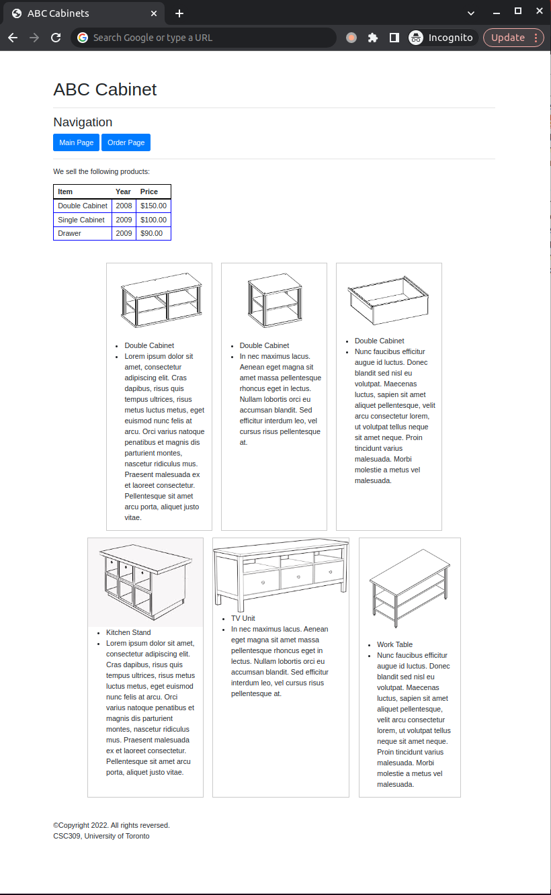
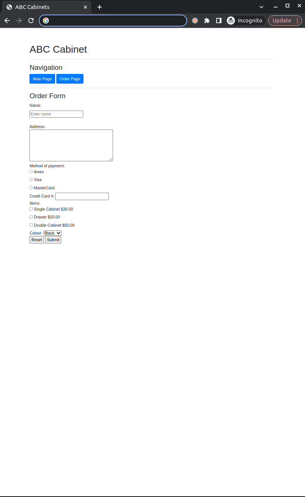

# CSC309 Tutorials: Week 2 (CSS)
Welcome to the CSC309 tutorials week 2. In this exercise, we will use Cascading Style Sheets (CSS) to make a web page great-looking and more user-friendly. Using CSS, you can control precisely how HTML elements look in the browser, using whatever design you like. At the end of this tutorial you will have a website similar to figure 1. 
However, if you change the screen size or zoom out, you will see that it will change the number of boxes showing the items accordingly since this is a responsive design.

<p align="center"> <br/>Figure 1: Your website at the end of week 2 session should look like figure above.</p>

## Introduction

CSS can be used for very basic document text styling, for example, for changing the color and size of headings and links. It can be used to create a layout, effects, etc. CSS is a rule-based language. You define the rules by specifying groups of styles that should be applied to particular elements or groups of elements on your web page:

```css
h1 {
  color: red;
  font-size: 5em;
}

p {
  color: black;
}

```

There are so many things you could style using CSS, so the language is broken down into modules. Modules like [Backgrounds and Borders](https://developer.mozilla.org/en-US/docs/Web/CSS/CSS_Backgrounds_and_Borders), [Fonts](https://developer.mozilla.org/en-US/docs/Web/CSS/CSS_Fonts) are easy to understand and some others like [Flexible Box Layout](https://developer.mozilla.org/en-US/docs/Web/CSS/CSS_Flexible_Box_Layout) or [Grid Layout](https://developer.mozilla.org/en-US/docs/Web/CSS/CSS_Grid_Layout) require a bit more reading and understanding. In this tutorial we will expolre how to use and modify some of the rules within some of these modules.

## Inspect Tool
For the purpose of this tutorial, we would recommend using Inspect tools on [Google Chrome](https://developer.chrome.com/docs/devtools/overview/) or [Mozilla Firefox](https://firefox-source-docs.mozilla.org/devtools-user/page_inspector/how_to/open_the_inspector/index.html). You just need to locate the section you want to add or modify its style, right-click and select Inspect to jump into the Elements panel. Now you can start working on styles (check [here](https://developer.chrome.com/docs/devtools/css/) for more information).

---
## Required Tasks for Week 2
You need to work on `main.html`, `order.html` and `style.css`. 
### main.html
You only need to import and link CSS files in this file and find out which class could be used for some elements. Look at the file itself for further information. There are not many things to do in this file!

### order.html
Like `main.htnl`, you only need to import and link CSS files. Look at the file itself for further information.

### style.css
Most of the work will be done in this file. You need to write some custom rules for the classes that are specified. Look at the file itself for further information.

#### Extra Steps
Once you complete the `style.css`, using the Inspect tool, try to follow the steps below, change some of the properties and see the effects. 

For the `.container-flex` class try changing the following and see the effects:
- `gap`: You can specify fix values for the `gap` as `px`, however, to have a responsive page, it is better to use `em` and `rem` as a relative unit. See more information [here](https://chiamakaikeanyi.dev/sizing-in-css-px-vs-em-vs-rem/).
- `flex-flow`: Change the value of this property to `row-reverse wrap` and `column wrap`. With the `column wrap`, how many columns do you see? Why?
- `align-content`: Change this property to `flex-start`, `flex-end`, `center` and `stretch`. See what is happening in each case.
- `justify-content`: Try assigning the following values and see the effects: `center`, `flex-start`, `flex-end`, `space-between`, `space-evenly` and `space-around`

For the `.flex-item` class:
- Increase and decrease the value of `flex-basis` property. How does the overall view change? 


---

Fall 2022, CSC309 Tutorial