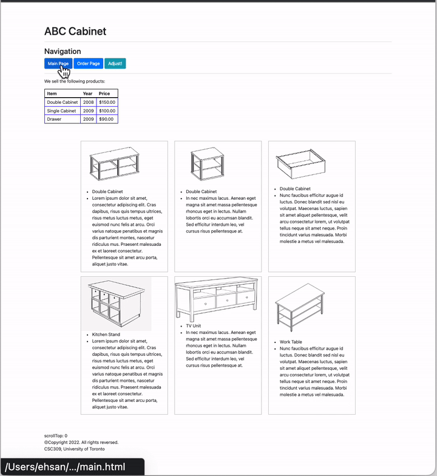
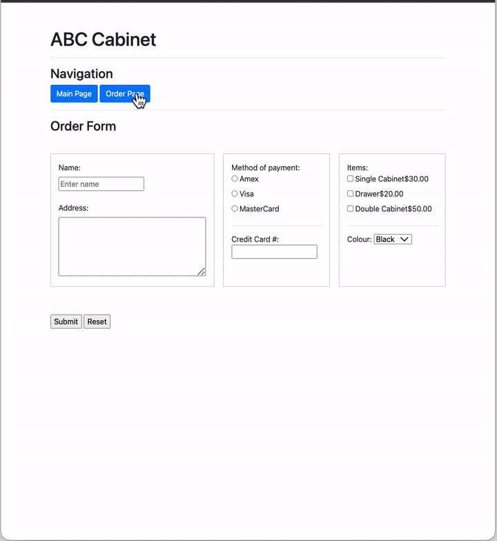

# CSC309 Tutorials: Week 3 (JavaScript)
Welcome to the CSC309 tutorials week 3. This week, we will use JavaScript to manipulate web pages. On the `main.html` page, when you click on the `Adjust!` button, the minimum height of all images is found. Then the height of all other images is set to this value. In addition, when the mouse enters any block with class `flex-item`, the border and product name colour change to a random colour. On the `order.html` page, once a user clicks on the checkboxes to select items, the total costs of their selection and their name will be displayed in a message box.

<p align="center"> <br/>Basic functionality of the site at the end of week 3.</p>

## Basics
Here some basics of JavaScript are reviewed. Remember that a semicolon at the end of a line indicates where a statement ends. It is only required when you need to separate statements on a single line.
### Variable types:
| Type | Example |
| --- | --- |
| String | "abcd..." |
| Number | 1234 |
| Boolean | true, false |
| Array | [1,45,32,"srt"] |
| Object | document.querySelector('h1'); |
### Operators:
| Type | Operator | Example |
| --- | --- | --- |
| Subtraction, Multiplication, Division | + - * /| `2+3`, `4-1`, `4/2` |
| Assignment | = | `varialbe = 5` |
| Strict Equality _(performs a test to see if two values are equal)_ | ===  | `myVariable === 4` |

### Some code samples:
```js
// Declaring a variable
let myVariable = "something";
myVariable = "something else";

// What is the difference between var & let?
// https://stackoverflow.com/questions/762011/

/* constant variable:
   - cannot be Redeclared
   - cannot be Reassigned
   - have Block Scope
*/
const PI = 3.141592653589793;

// If else condition
if (iceCream === 'chocolate') {
  alert('Yay, I love chocolate ice cream!');
} else {
  alert('Awwww, but chocolate is my favorite…');
}

// One line condition
(iceCream === 'chocolate') ? alert('Yay!') : alert('Awwww')

// Loops
let myArray = [1,2,3,4,5,6,7,8,9]
for (let item of myArray){
  console.log(item);
}
for (let i = 0; i < myArray.length; i++) {
  console.log(myArray[i]);
}

// Styles
let myH1 = document.querySelector('div.h1');
myH1.style["font-weight"] = "bold";

```
### Functions: 
They are a way of packaging functionality that you wish to reuse:
```javascript
// built-in functions:
document.querySelector('h1');
alert('oh no!');
console.log('a message goes here!');

function multiply(num1,num2) {
  let result = num1 * num2;
  return result;
}
var myVar = multiply(2,5);
```
### Events
Real interactivity on a website requires event handlers. These are code structures that listen for activity in the browser, and run code in response. Some examples:
```js
let myButton = document.querySelector('.btn');
myButton.addEventListener('click', function () {
  alert('Ouch! Something happened!');
});

// Using arrow function:
let myButton = document.querySelector('.btn');
myButton.addEventListener('mouseenter', () => {
  alert('Ouch! mouseenter event triggered!');
});

myButton.addEventListener('mouseleave', () => {
  alert('Ouch! mouseleave event triggered!');
});

// Another way to do this:
myButton.onclick = function(){
  alert('Ouch! Someone clicked on me!');
};

```

### Some Functions to Check
Look further at these functions. We will use them frequently!
- `querySelector()`
- `querySelectorAll()`
- `getElementsByClassName()`
- `getElementById()`


---
## Required Tasks for Week 3
You need to work on `main.html`, `order.html` and `main.js` and `order.js`. You only need to import a local JavaScript file on the `main.html` and `order.html`. Most of the work will be done on the `main.js` and `order.js`. Look at the files for further instructions.


---

Fall 2022, CSC309 Tutorial