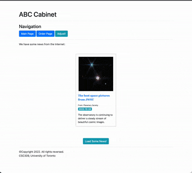

# CSC309 Tutorials: Week 4 (jQuery, API)
Welcome to the CSC309 tutorials week 4. This week, we fetch some news headlines using [Spaceflight News API](https://spaceflightnewsapi.net) and then populate the page using the retrieved data. 


> :warning: _Since we are using a free public API service, try to run as few API calls as you can. Otherwise, your IP might get blocked due to excessive usage._

# Getting Started

## jQuery
jQuery is a wrapper for JavaScript. When you start using jQuery, you will find it easier and quicker to work with. The following is a basic example of a jQuery code; you can find more information on many sources like [this one](https://www.digitalocean.com/community/tutorials/an-introduction-to-jquery).

```javascript
$(document).ready(function() {
  // all custom jQuery will go here and are executed
  // once the page is ready
  $("#demo").html("Hello, World!");
});
```

## Ajax
Ajax is the backbone of the Javascript application and is used to communicate between client and server. You can use _Callback_ or _Promise_ with Ajax. However, the code turns out to be challenging to understand and maintain when it comes to multiple Callbacks. In this tutorial, we are going to use Ajax using Promise. Let's look at an example:

```javascript
// API url
  let URL = "https://api.github.com/users/etesami";

  // call Ajax function, the Ajax function returns a jQuery XHR object
  let httpRequest = $.ajax({
      url : URL,
      method : "GET",
      dataType : "json"
    })

  // The "httpRequest" is a jQuery XHR object
  // It has four functions:
  //    done: means when the ajax call is succeeded
  //    always: means when the ajax call is completed
  //    fail: means when the ajax call is failed
  //    then: you will use 'then' to chain promises together
  httpRequest.then(function(respJson){
    // The earlier ajax call is returning a response and 
    // this is the first function that is called
    console.log(respJson.name);
    console.log(respJson.company);
  });

  httpRequest.fail(function(reason){
    // The codes below are executed when the call is failed
    console.log("error in processing your request", reason);
  });

  httpRequest.done(function(respJson){
    // The codes below are executed when the call is successful
    console.log("We are done, the call was successful");
  });
  
  httpRequest.always(function(respJson){
    // The codes below are executed regardless of whether or not the call was successful
    console.log("We are done, the call was successful");
  });
```
You can even putting them all together:

```javascript
// API url
  let URL = "https://api.github.com/users/etesami";
  $.ajax({
      url : URL,
      method : "GET",
      dataType : "json"
    }).then(function(respJson){
      console.log("First function in the chain!");
      console.log(respJson.name);
      console.log(respJson.company);
    }).fail(function(reason){
      console.log("error in processing the request", reason);
    }).done(function(respJson){
      console.log("We are done, the call was successful");
    }).always(function(respJson){
      console.log("The call was completed.");
    });
```

The reason you may use `then` method is, often, there are multiple operations that have to succeed before proceeding to the next step. You may need to make two or more separate requests where one request is dependent on the success of another. 


These are all you need to know to complete this week's tutorial. We have a page titled "ABC News" which lists news from a public free news API service. Your job here is to complete `main.js` to represent a page like this

<p align="center"><br/>Basic functionality of the site at the end of week 4.</p>

---

Fall 2022, CSC309 Tutorial